<div align="center">


[Русский](README.ru.md) • **English**

**See where every dollar comes from. Know where every dollar goes.**

A self-hosted personal finance app built to replace the kind of hand-made spreadsheet people keep for years — and to answer the questions such a spreadsheet cannot.


[](https://github.com/Zproger/Aurum)
[](LICENSE)

[Features](#features) • [Getting started](#getting-started) • [API](DOCS.md) • [Security](#security) • [Credits](#credits)

</div>

> The original project is **[Zproger/Aurum](https://github.com/Zproger/Aurum)** by **[ZProger](https://github.com/ZProger)**. Aurum-Ex is an extended version that has grown into a project of its own, with its own direction. The original is developed independently: report its bugs there, not here.

## What this is

**Ex stands for Extended.** The fork grew out of a real problem: replacing a four-year-old Google Sheets ledger with something that keeps every number it already held and answers the questions the sheet could not.

Ledgers like that hit the same walls. One level of subcategories, so "Groceries → Dairy → Cheese" is impossible. No line items, so a receipt is a single number and price history for one product cannot exist. No way to tell a transfer from a friend apart from money actually earned. An opening balance that has to be booked as income because there is nowhere else to put it.

Aurum-Ex is what those walls turned into:

| The wall | What replaced it |
|---|---|
| One level of subcategories | Arbitrary nesting, any level selectable on a transaction |
| A receipt is one number | Optional line items with quantity, unit and unit price |
| No product history | Product and store directories, a price curve per item, per unit of measure |
| Transfers counted as income | Settlements with people: debts and loans are distinct, neither is earnings |
| One currency | Multi-currency with central-bank rates on the transaction date |
| Opening balance booked as income | A real opening balance on the account |
| Everyone shares one column | Participants — who the income or expense was for, pets included |
| HTTP Basic Auth | A real login with a server-side session |

## Screenshots

> **Everything on these screens is made up.** The demo install is raised from
> scratch and seeded by [scripts/demo_seed.py](scripts/demo_seed.py): not one
> number, name or date comes from anybody's real history.

<div align="center">
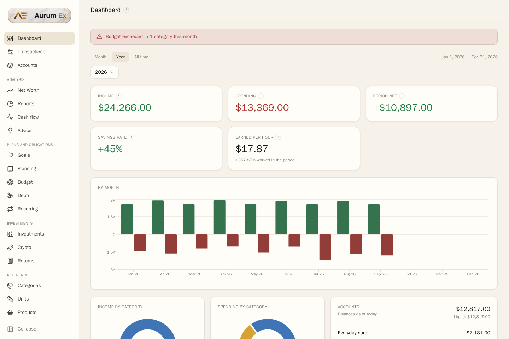
</div>

<details>
<summary><b>Fourteen more screens</b> — every section and all three designs</summary>

<div align="center">

<table>
  <tr>
    <td width="33%"><a href="images/en/1-dashboard.png"></a><br /><sub>Dashboard — Gold</sub></td>
    <td width="33%"><a href="images/en/14-dashboard-modern-dark.png">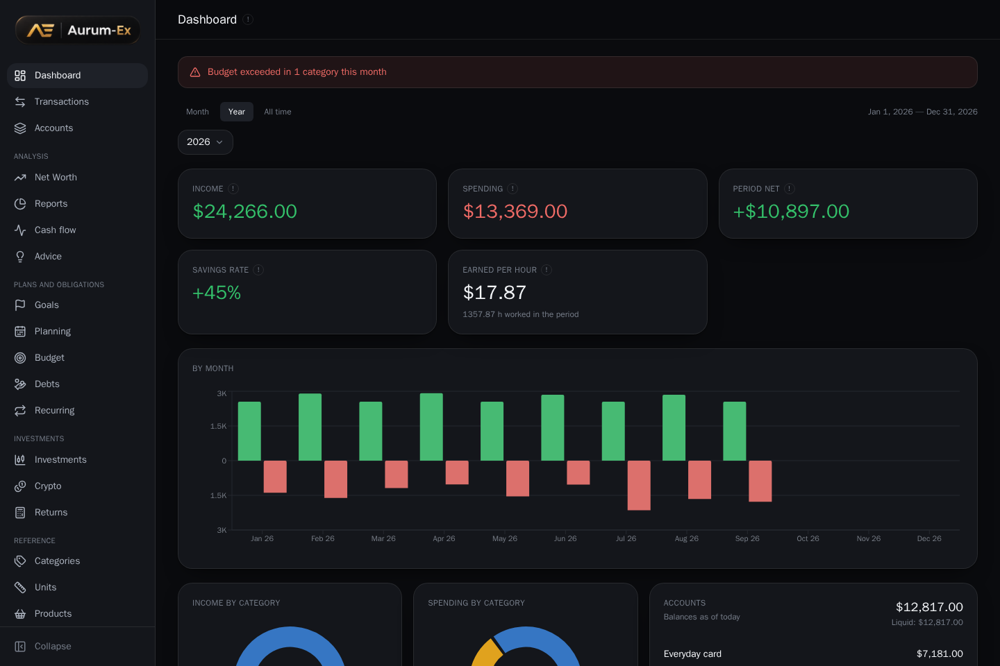</a><br /><sub>Dashboard — Modern, dark</sub></td>
    <td width="33%"><a href="images/en/15-dashboard-legacy.png">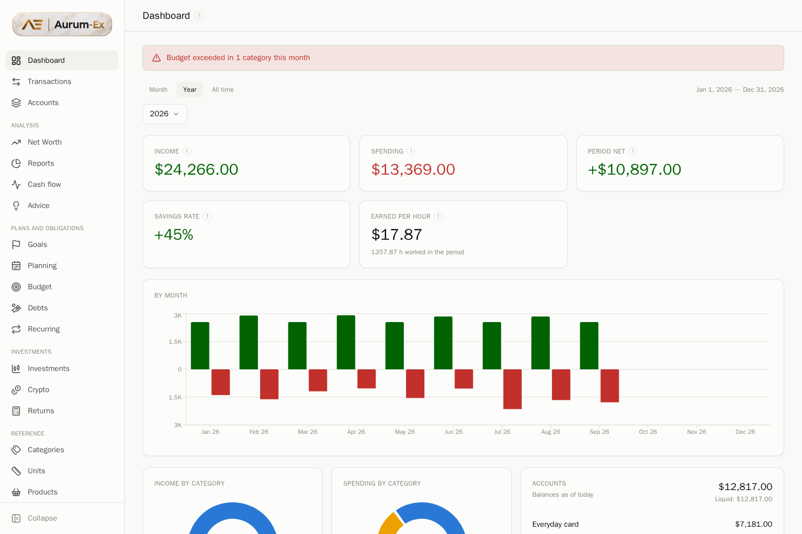</a><br /><sub>Dashboard — Classic</sub></td>
  </tr>
  <tr>
    <td width="33%"><a href="images/en/2-transactions.png">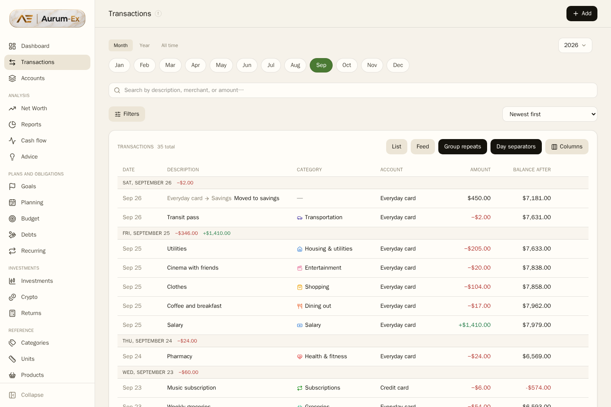</a><br /><sub>Transactions</sub></td>
    <td width="33%"><a href="images/en/3-accounts.png">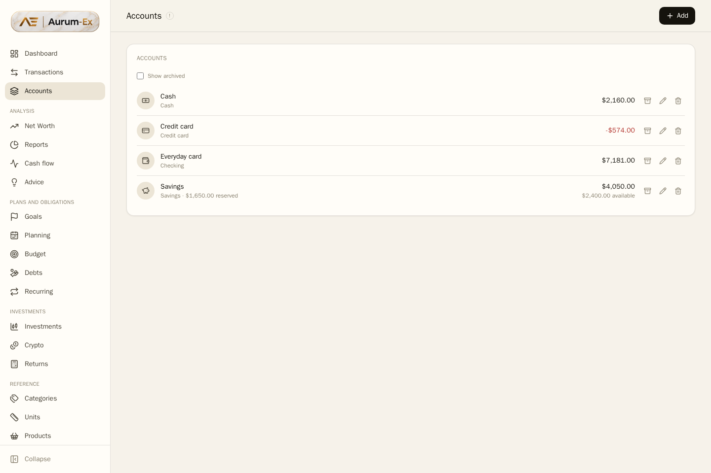</a><br /><sub>Accounts</sub></td>
    <td width="33%"><a href="images/en/4-net-worth.png">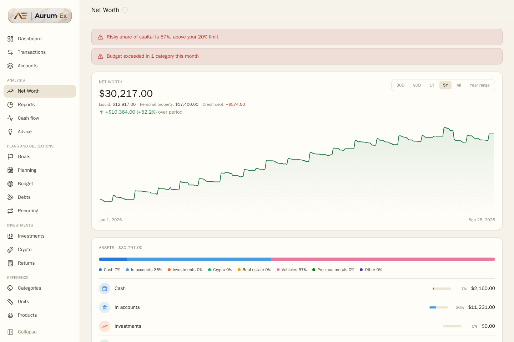</a><br /><sub>Net worth</sub></td>
  </tr>
  <tr>
    <td width="33%"><a href="images/en/5-reports.png">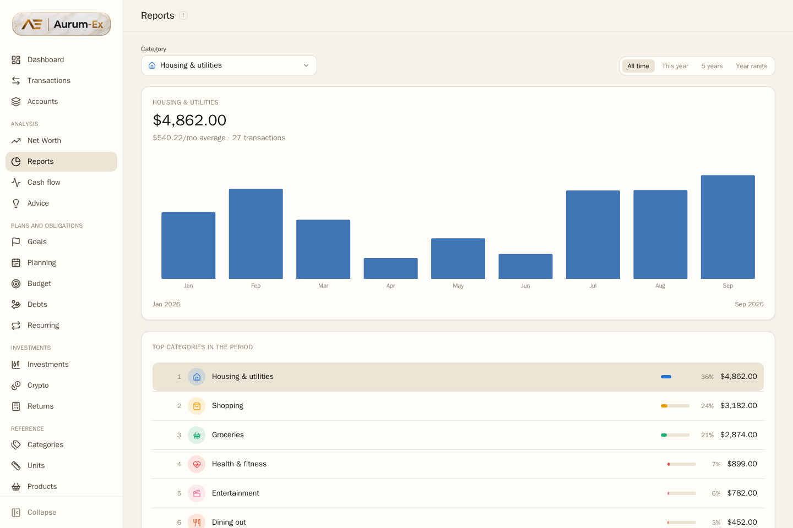</a><br /><sub>Reports</sub></td>
    <td width="33%"><a href="images/en/6-cash-flow.png">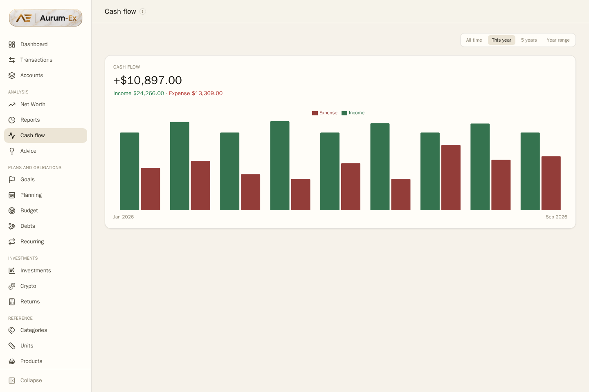</a><br /><sub>Cash flow</sub></td>
    <td width="33%"><a href="images/en/7-advice.png">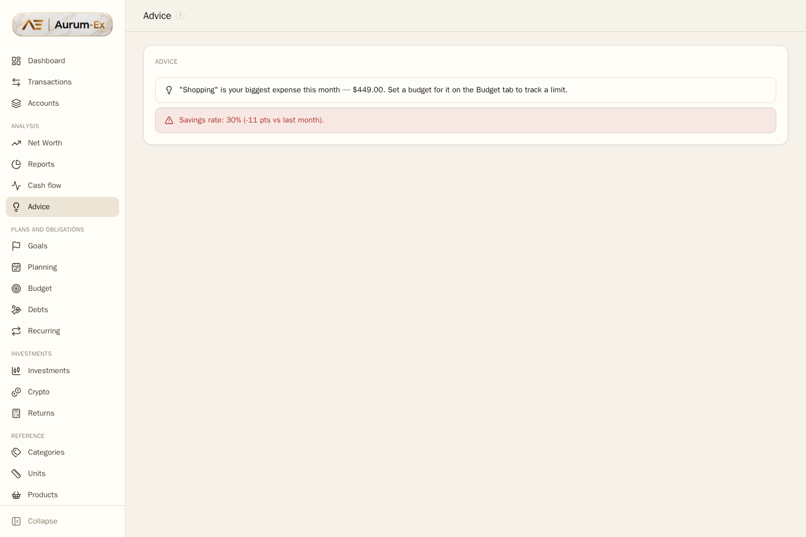</a><br /><sub>Advice</sub></td>
  </tr>
  <tr>
    <td width="33%"><a href="images/en/8-goals.png">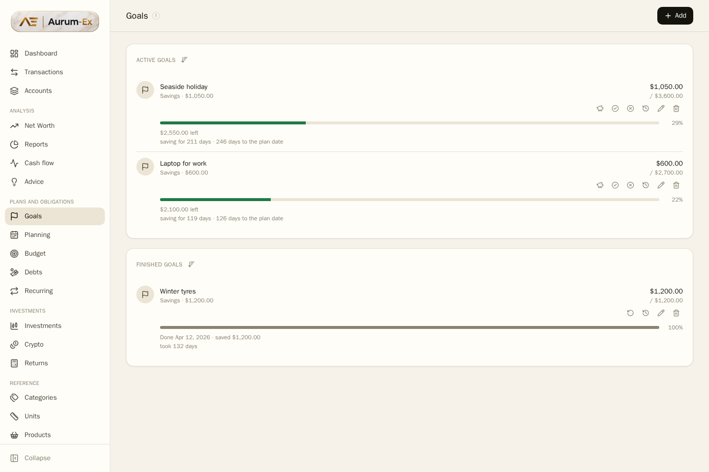</a><br /><sub>Goals</sub></td>
    <td width="33%"><a href="images/en/9-planning.png">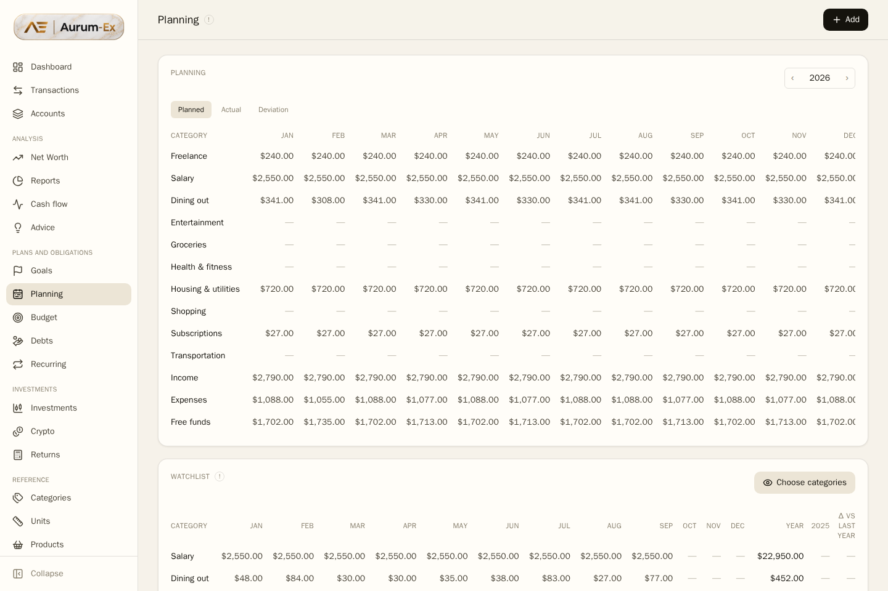</a><br /><sub>Planning</sub></td>
    <td width="33%"><a href="images/en/10-budget.png">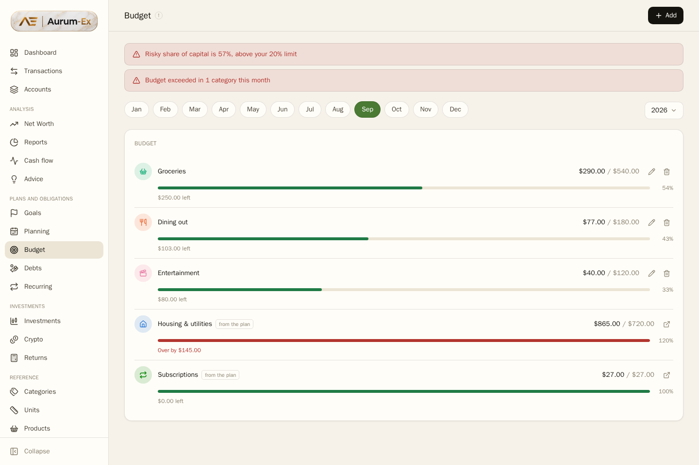</a><br /><sub>Budget</sub></td>
  </tr>
  <tr>
    <td width="33%"><a href="images/en/11-debts.png">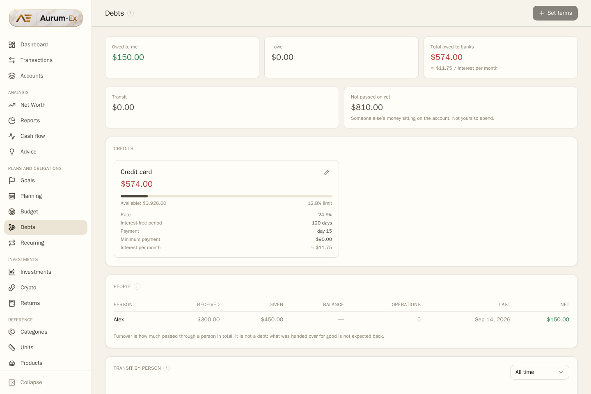</a><br /><sub>Debts</sub></td>
    <td width="33%"><a href="images/en/12-investments.png">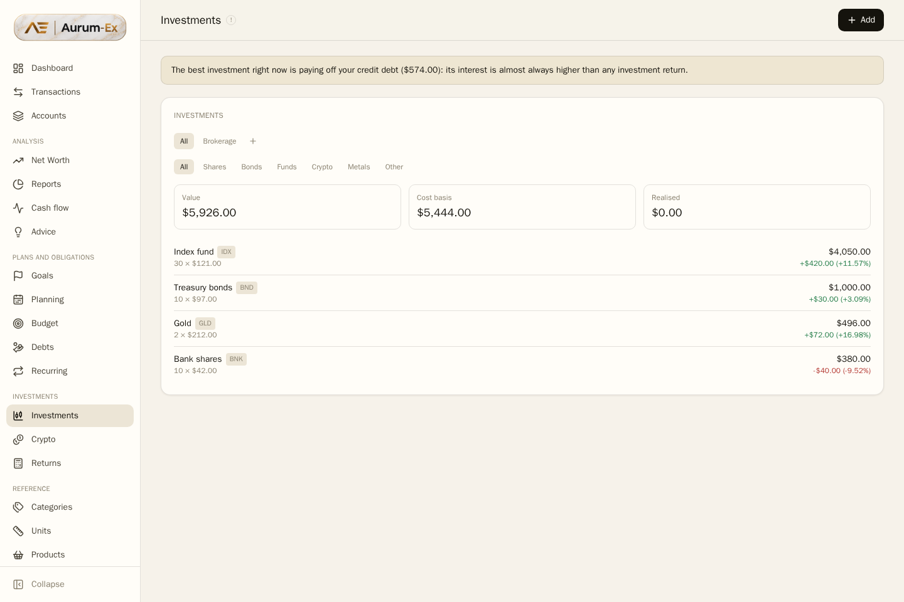</a><br /><sub>Investments</sub></td>
    <td width="33%"><a href="images/en/13-products.png">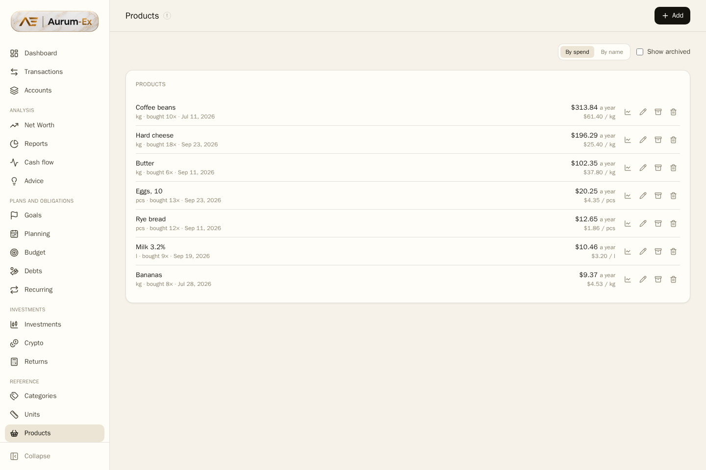</a><br /><sub>Products</sub></td>
  </tr>
</table>

</div>

The first row is one dashboard in three designs: Gold, Modern and Classic.
Each has a light and a dark mode; the rest of the screens are Gold light.
Switched in settings, remembered by the browser.

</details>

The interface is fully translated: the same screens in Russian live in
[README.ru.md](README.ru.md).

## Features

### Money in, money out

- **Transactions** with type, category, participant, tags and notes; split across several categories when one receipt covers several things.
- **Period switch** — month, year, or all time. A per-account statement over a single month tells you nothing; sorting out two linked accounts needs the whole history.
- **Per-account statement** showing both sides of every transfer, with the running balance computed for the account you picked.
- **Grouping of repeats** — four bus rides on one day collapse into one row, "Bus ×4".
- **Day dividers** with daily totals, so the list reads like a bank statement.
- **Accounts** grouped by bank, with credit terms, grace periods and instalment plans.
- **Cost in hours worked** — what a purchase cost in working time, at the hourly rate of the year it happened in.

### Analysis

- **Dashboard** — real income, spending, net, savings rate, hourly earnings, spending by category, largest expenses, month-by-month flow.
- **Cash flow** — income against expense over any range, opening balance included.
- **Reports** — category spending over time, opening on the largest category rather than the first alphabetically.
- **Net worth** — assets minus liabilities over time, never drawn earlier than the first record: a flat zero line is a claim the data does not support.
- **Advice** — plain observations drawn from your own numbers, not generic tips.

### Plans

- **Budgets** — monthly ceilings that warn when crossed.
- **Planning** — one-off, monthly and daily plans expanded across a whole year. Daily plans can count working days instead of calendar days, so February recalculates itself.
- **Watchlist** — the few categories you are watching right now, month by month, next to last year's total.
- **Goals** with contributions, linked to a real account.
- **Recurring payments** with a posting schedule.
- **Debts and settlements** — who owes whom, kept out of income entirely.

### Investments

- **Portfolio** with FIFO lot accounting — the oldest lot is sold first, because average cost quietly understates a loss.
- **Crypto** with live prices via CoinGecko (a free key is enough) and per-portfolio grouping.
- **Return calculator** — compound interest, contributions, projections.

### Directories and data

- **Categories** with arbitrary nesting, colours and icons, applied to a whole branch on request.
- **Products, stores and units** with conversion to a base unit, so 1.5 l at $3.20 and 500 ml at $1.45 are finally comparable.
- **Spreadsheet import** — bring in a Google Sheets ledger with a preview before anything is written, and automatic nesting of a flat category list. See [docs/spreadsheet-import.md](docs/spreadsheet-import.md).
- **CSV import** of bank statements.
- **Full backup and restore** covering every table, guarded by a test that counts every row before export and after restore.

### The application itself

- **Three designs** — Gold (obsidian and gold, marble in light mode), Modern (the same accent with more air and motion) and Classic (the original Aurum look). Each with a light and a dark mode. See [docs/brand.md](docs/brand.md).
- **Bilingual** — Russian and English throughout.
- **Mobile first** — every screen works on a phone, wide tables included.
- **Help badges** — a "!" beside a section title explains what it is for and why it exists.
- **A real login** — login screen, server-side session, brute-force protection, recovery key.
- **REST API** for everything the interface can do — see [DOCS.md](DOCS.md).

## Getting started

Three containers — Postgres, a FastAPI backend and an nginx-served frontend — wired with Docker Compose. Nothing else needs installing.

```bash
git clone https://github.com/Code0I7/Aurum-Ex.git
cd Aurum-Ex
cp .env.example .env
```

Change two values in `.env` before the first run:

| Variable | What it does |
|---|---|
| `AURUM_POSTGRES_PASSWORD` | Password for Aurum-Ex's own Postgres. The template ships `change-me` on purpose. |
| `AURUM_RECOVERY_KEY` | Emergency key for resetting a forgotten password (`openssl rand -base64 48`). Leave it empty and reset is disabled entirely. |

Leave `AURUM_ADMIN_PASSWORD` empty: the app will ask you to set a password in the browser on first open, and it never reaches a file on disk.

```bash
docker compose up -d --build
```

Open **http://localhost:3000**. Migrations run automatically; a default account and the standard categories are seeded.

```bash
docker compose down          # stop, keep data
docker compose up -d         # start again
docker compose down -v       # stop AND delete data permanently
git pull && docker compose up -d --build   # update
```

Data lives in a Docker volume (`aurum_pgdata`), not in the repo folder: it survives rebuilds and `git pull`. Before anything risky, export a backup from **Settings → Backup**.

### Publishing it over TLS

The optional `edge` service is an nginx in front of the app, with a Let's Encrypt certificate and a secret-link gate: the first visit carrying the key sets a cookie for a year, and anything without it gets a silent connection close. By default it listens on a non-standard port: 443 is often already taken on a machine that hosts something else, and a browser does not mind a port in the address as long as the certificate is real.

Enable it by adding `COMPOSE_PROFILES=public` to `.env` along with `AURUM_DOMAIN`, `AURUM_PUBLIC_PORT` and `AURUM_GATE_KEY`. Without those lines, `docker compose up -d` starts the same three containers as before.

For an ordinary address with no port in it, set `AURUM_PUBLIC_PORT=443` and nothing else. The port has to be free, or the container will not start — on a machine already running its own nginx or another panel, 443 usually belongs to them.

## Security

Unlike the original, Aurum-Ex has a login of its own:

- **Login screen and server-side session.** The password is stored hashed (scrypt); the session lives in an HttpOnly cookie a page script cannot read. Logging out actually ends the session on the server.
- **One account per household.** This is not multi-user: everyone signs in as the same administrator and sees the same data, distinguished by the participant on a transaction. That is how a family budget works.
- **A forgotten password** is reset with `AURUM_RECOVERY_KEY`, known only to whoever owns the server. A normal password change requires the current one, so nobody locks the household out by accident.
- **Brute-force protection** — after `AURUM_MAX_FAILED_LOGINS` failures, login is blocked for `AURUM_LOCKOUT_MINUTES`.
- **`AURUM_SECURE_COOKIES=true`** when published. Browsers make an exception for `localhost`, so an SSH tunnel keeps working.

## Tech stack

- **Frontend:** React 19, TypeScript, Vite, Tailwind CSS, TanStack Query, Recharts
- **Backend:** FastAPI, SQLAlchemy 2.0 (async), Alembic, Pydantic v2
- **Database:** PostgreSQL 16
- **Deployment:** Docker Compose, optional nginx + Let's Encrypt front door

## Contributing

This is a personal project, and changes here follow one specific ledger. Before opening a pull request, check whether it belongs upstream instead: **fixes and improvements to base Aurum are better sent to [Zproger/Aurum](https://github.com/Zproger/Aurum)**, where they reach everyone. [CONTRIBUTING.md](CONTRIBUTING.md) describes the dev environment and what to check before opening a pull request.

## License

Same license as the original — [PolyForm Noncommercial License 1.0.0](LICENSE). A fork cannot loosen the original's terms and does not try: [LICENSE](LICENSE) is untouched, required notice included.

`Required Notice: Copyright ZProger (https://github.com/ZProger)`

In plain words: read it, run it, modify it, and use it for any personal, educational or non-commercial purpose, free and forever. You may not sell it or a modified version, host it as a paid service, or build a commercial product on it. This is **not** an OSI-approved open source license — it is **source-available**. The exact terms are in [LICENSE](LICENSE).

Anyone redistributing this code must pass along the license text (or a link to it) **and** the `Required Notice` above. It refers to the original author and does not go away no matter how much is reworked.

## Credits

The whole foundation of this project is someone else's work. **[ZProger](https://github.com/ZProger)** wrote [Aurum](https://github.com/Zproger/Aurum) — the architecture, the net worth engine, the analytics, the Docker setup and the bilingual interface — and opened the source, which is the only reason this fork exists at all. The domain model here has been reworked for a far more detailed ledger — nested categories, receipt lines, settlements with people — but the frame everything hangs on is his.

If this project turned out useful, support the original author rather than the fork: **[Donate via Lava](https://app.lava.top/782447112?tabId=donate)**. A star on the original repository helps him more than a star on this one.

Most of the code in this fork — the data model rework, the services, the migrations, the tests and this README — was written with **[Claude](https://claude.com/claude-code)** by **[Anthropic](https://www.anthropic.com/)**, working from a description of what the spreadsheet could not do. The decisions about what to build, and the judgement about whether the result was honest about the numbers, stayed with a human.

---

<div align="center">

**Like the idea? Star [the original Aurum](https://github.com/Zproger/Aurum) — this grew out of it.**

</div>
